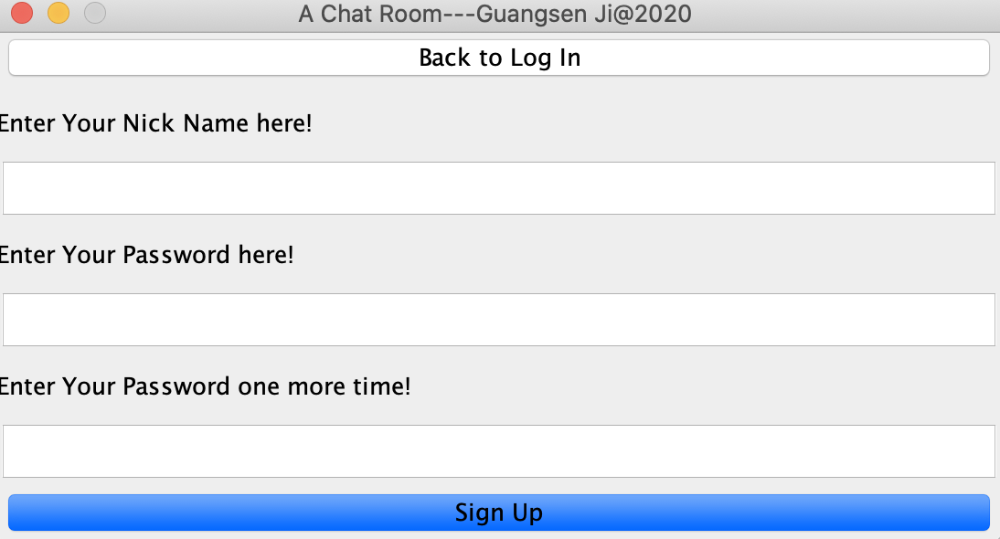
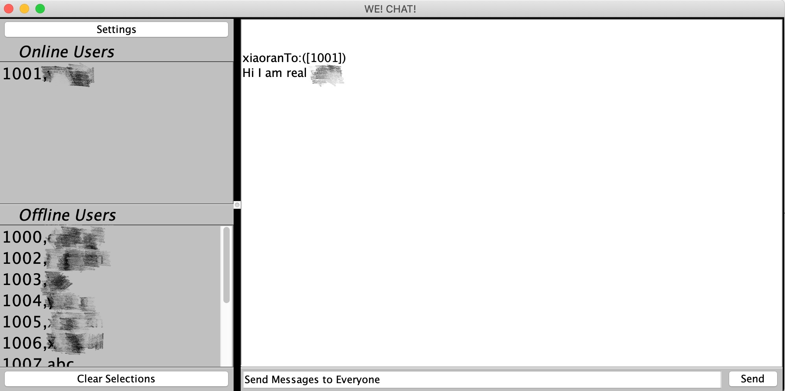
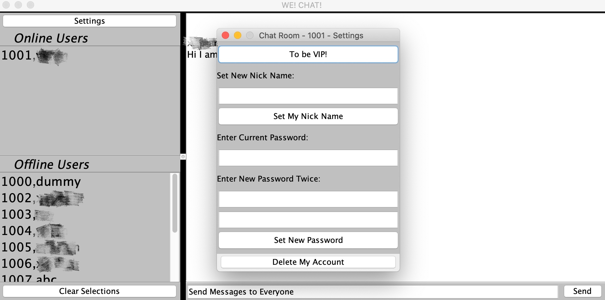

# We! Chat!
This is a chat room supports both public and private chat. As a new user, all you have to do is to sign up and chat !

## Getting started
Following instructions will help you run this chat room on your laptop. Be ready to connect with thousands of others in the world!

### Prerequisites
1. Go to [Java SE Downloads](https://www.oracle.com/java/technologies/javase-downloads.html) to download the latest version of JDK
2. Download the [ClientFor_*](https://github.com/Ji1998/Chat_Room-2020/tree/master/src/main/java/com/mycompany/app) files and save them in the same local directory

### Installing
In your teminal, move to the directory you just save the ClientFor_* files, run the ClientFor_Login.java as shown
```
javac ClientFor_login.java
java ClientFor_login
```
<h5>Great! You should see this pop up on your screen: <h5>

<h5> Don't have an account yet? sign up here. Then you will receive the account number shown in the app. And remember account number is how you can log in<h5>
<h5> Also for safety purpose, the password must be as least 6 characters long <h5>

<h5> Then you can begin your chat! Click user's name to send private message, and "clear selection" to send public message<h5>

<h5> Want to change your name and password? click on setting<h5>

 
## For Developers
This app is seperated into 5 modules, which are "Server", "Running_Thread", "ClientFor_login", "ClientFor_chat", "ClientFor_setting" in order for future development and maintance. 
* "Server":  responsible for build connection with GCP and Socket connection with client
* "Running_Thread": responsible for receive client's request and make corespondence feedback
* "ClientFor_login" : responsible for loading login UI and check user name & password with database, also resonpisble for signup
* "ClientFor_chat" : responsible for update online user list and offline userlist, and also deal with sending & receving message
* "ClientFor_setting": responsible for settings including change password, change name etc...

### Build with
* [MAVEN](https://maven.apache.org/install.html)
* [GCP Compute Engine](https://cloud.google.com/)
* [Firebase](https://firebase.google.com/)
* [IBM DB2](https://www.ibm.com/analytics/db2?p1=Search&p4=43700056057814401&p5=e&cm_mmc=Search_Google-_-1S_1S-_-WW_NA-_-ibm%20db2_e&cm_mmca7=71700000060951781&cm_mmca8=kwd-300711378925&cm_mmca9=EAIaIQobChMIivaagaSD6wIVCkmGCh26YAsJEAAYASAAEgI-K_D_BwE&cm_mmca10=452224447397&cm_mmca11=e&gclid=EAIaIQobChMIivaagaSD6wIVCkmGCh26YAsJEAAYASAAEgI-K_D_BwE&gclsrc=aw.ds)
* [Java Swing](https://docs.oracle.com/javase/tutorial/uiswing/)
* [JDBC SQL](https://docs.microsoft.com/en-us/sql/connect/jdbc/microsoft-jdbc-driver-for-sql-server?view=sql-server-ver15)


###  Several functions implemented from perspective of developers:
* The server is able to handle multiple users login and chat at the same time through Thread Pool. Each user will assgined a thread in charge of receving and responding client requests
* The server will tell client who is online and who is not online. 
* The server will save public and private messages into database. Once the next time a user login, he/she can see these messages
* The protocol for communicating between server and client is independent, whcih will bring convenience in the future if developers plan to add new features
* The "server" and "running_thread" is seperate. The developers only have to change the code in "server" if he/she want to change the database type.
* The client GUI is implemented through Java Swing
* The thread of receving response from server and the GUI thread is different. Hence the GUI won't stuck if the client is waitig for response from the server

